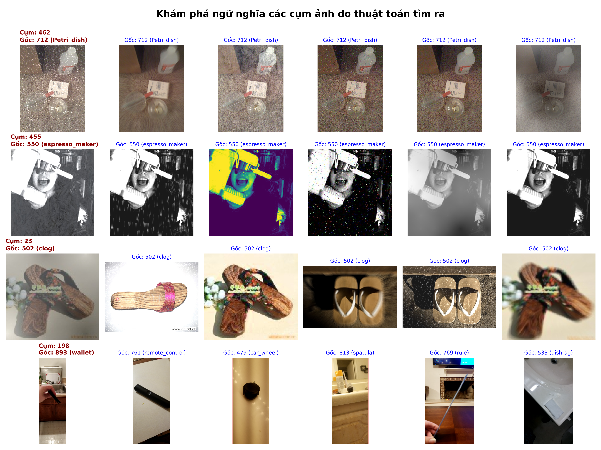
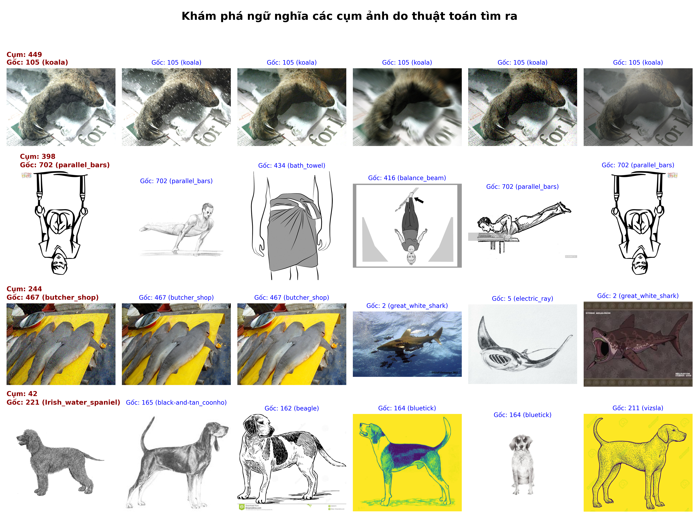

# ImageNet-Hard Community Structure Identification

Dự án này tập trung vào việc xác định cấu trúc cộng đồng (clustering) trong bộ dữ liệu **ImageNet-Hard** bằng cách sử dụng các đặc trưng (embeddings) từ mô hình **CLIP** kết hợp với thuật toán Leiden. Hệ thống được tối ưu hóa thông qua các kỹ thuật tiền xử lý dữ liệu nâng cao như **ZCA Whitening** và xây dựng đồ thị **Mutual k-Nearest Neighbors (MkNN)**.

## Tính năng chính

- **Feature Extraction (CLIP-ViT-L/14)**: Trích xuất đặc trưng bằng kỹ thuật **10-crop augmentation** (5 vùng cắt kết hợp lật ngang) để tạo ra vector đặc trưng ổn định, giảm thiểu nhiễu từ góc chụp.
- **ZCA Whitening**: Áp dụng tiền xử lý giúp triệt tiêu sự tương quan (decorrelation) giữa các chiều dữ liệu và chuẩn hóa phương sai, tối ưu hóa không gian vector cho phép đo Cosine.
- **MkNN Graph with Jaccard Weight**: Xây dựng đồ thị **Mutual k-Nearest Neighbors**. Trọng số cạnh được tính bằng cách kết hợp độ tương đồng Cosine và chỉ số Jaccard (dựa trên tập láng giềng chung), giúp làm nổi bật các cấu trúc cộng đồng tự nhiên.
- **Hyperparameter Optimization**: Tích hợp công cụ **Grid Search** để tìm bộ tham số **(k, threshold, resolution)** tối ưu dựa trên các thang đo chuẩn **ARI** và **NMI**.
- **Semantic Visualization**: Tự động sinh lưới hình ảnh đại diện cho các cụm để đánh giá sự đồng nhất về mặt ngữ nghĩa giữa các nhãn gốc và kết quả phân cụm.

## 📊 Kết quả thực nghiệm

### Trực quan hóa các cụm (Output)

Dưới đây là ví dụ về các cụm hình ảnh có cùng đặc điểm ngữ nghĩa được thuật toán tìm ra sau quá trình phân tích:



_Hình ảnh: Minh họa các cụm ảnh có sự đồng nhất về mặt ngữ nghĩa (semantic similarity) được trích xuất từ bộ dữ liệu._

### Bộ tham số tối ưu (Best Parameters)

Dựa trên quá trình **Grid Search**, bộ tham số mang lại hiệu quả phân cụm tốt nhất (tối ưu hóa chỉ số ARI và NMI) cho hệ thống bao gồm:

| Tham số                  | Giá trị tối ưu | Ghi chú                                                |
| :----------------------- | :------------- | :----------------------------------------------------- |
| **k (Neighbors)**        | `50`           | Số lượng láng giềng trong đồ thị kNN.                  |
| **Similarity Threshold** | `0.3`          | Ngưỡng tương đồng Cosine tối thiểu để thiết lập cạnh.  |
| **Resolution (Leiden)**  | `0.01`         | Tham số kiểm soát độ chi tiết của các cộng đồng (CPM). |
| **Random Seed**          | `42`           | Đảm bảo tính tái lập của kết quả phân cụm.             |

## Quy trình thực hiện (Pipeline)

Hệ thống được vận hành qua 4 giai đoạn chính:

- **1. Feature Extraction:**
- Sử dụng mô hình openai/clip-vit-large-patch14.
  Công thức ZCA Whitening:
  $$W = V \Lambda^{-1/2} V^T$$
- **2. Grid Search**: Thử nghiệm $k \in [15, 80]$ và Threshold từ $0.1$ đến $0.6$ để tìm điểm cân bằng giữa độ phủ và độ chính xác.
- **3. Community Detection**: Triển khai thuật toán Leiden với lớp **CPMVertexPartition** (Constant Potts Model) để phân tách các cộng đồng trong đồ thị đặc trưng.
- **Visualization**: Trích xuất các mẫu ảnh từ mỗi cụm để đánh giá kết quả bằng mắt thường.

## Cài đặt

```bash
pip install -r requirements.txt
```

## Hướng dẫn sử dụng

- **1. Trích xuất đặc trưng**
  Chạy script để tải dataset ImageNet-Hard, trích xuất embeddings và lưu dưới dạng .npy.

```bash
python feature_extraction.py
```

- **2. Tìm kiếm tham số tối ưu**
  Chạy Grid Search để xác định giá trị $k$ và resolution tốt nhất cho bài toán.

```bash
python grid_search.py
```

- **3. Chạy phân cụm chính thức**
  Sử dụng các tham số tốt nhất đã tìm thấy để tiến hành phân cụm toàn bộ dữ liệu.

```bash
python main.py
```

- **4. Trực quan hóa kết quả**
  Tạo grid ảnh để xem các hình ảnh trong cùng một cụm có thực sự liên quan đến nhau không.

```bash
python visualize.py
```

## Kết quả

Sau khi thực hiện, hệ thống sẽ lưu kết quả tại:

- **features.npy & labels.npy**: Dữ liệu đặc trưng đã xử lý.
- **y_pred.npy**: Nhãn dự đoán từ thuật toán Leiden.
- **output/cluster_images_grid.png**: Hình ảnh trực quan các cụm.
